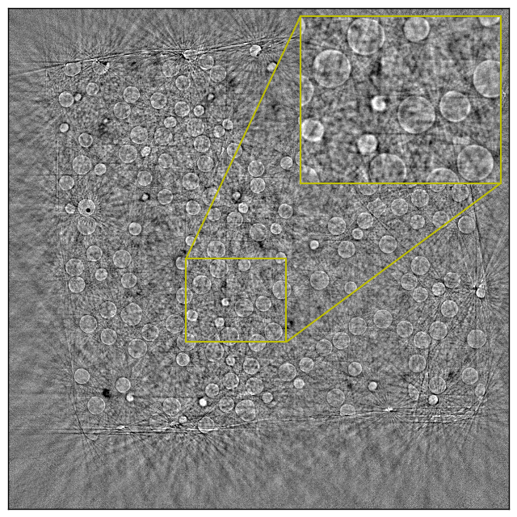
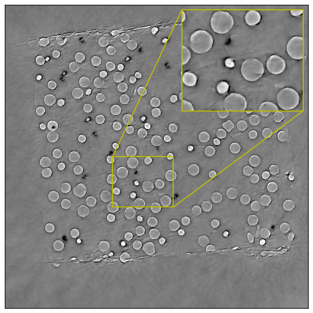

If you are new to using convolution neural network for image restoration, we have some tutorial Jupyter [notebooks](https://github.com/lzhengchun/dn-tutorial). 

# TomoGAN

Paper: [arXiv:1902.07582](https://arxiv.org/abs/1902.07582); [arXiv:1910.04081](https://arxiv.org/abs/1910.04081) Relevant [presentation](https://lzhengchun.github.io/file/pse-ai-townhall-TomoGAN-Zhengchun-Liu.pdf)

[](https://doi.org/10.1109/DLS49591.2019.00008)
[](https://doi.org/10.1364/JOSAA.375595)

An image quality enhancement model based on generative adversarial networks originally developed for synchrotron X-Ray tomography. It has also been used for other case like streaming tomography, the joint ptycho-tomography problem([arXiv:2009.09498](https://arxiv.org/abs/2009.09498)). We also developed a workflow to deploy TomoGAN on Coral edge TPU ([arXiv:1911.05878](https://arxiv.org/abs/1911.05878)) which can process an image with 1k x 1k pixels in 500ms. 

I also implemented the generator model based on pure Intel DNNL (MKL-DNN) and NVIDIA cudnn seperately for inference, using C++, so that you can easily integrate it in your C++ project. I will open source them soon.

To give it a try:

* download sample dataset (only need to download _dataset/demo-dataset-real.h5_) from [Here](https://anl.box.com/s/h6koi0hhwqrj1c9tt82tldzo45tl3x15)
* install dependencies, Tensorflow(preferably 1.13 for TF1 version, 2.2 for TF2 version)
* run with ```python ./main-gan.py -gpu=0 -expName=test -dsfn=dataset/demo-dataset-real.h5```

Train a model with your own dataset

* one of the code-free way is to prepare a h5 file with four datasets as the sample dataset demo-dataset-real.h5. for datasets in the h5 should be named as: _train_ns_ (noisy input) and *train_gt* (clean, label) for training; *test_ns* (noisy input) and *test_gt* (clean label) for validation, each dataset should have a dimension of (N, H, W) where N is the number of images.
* Best practice: always good to make sure that there is no outliers (e.g., due to bad pixels in detector) in your data.
```
h5dump -H demo-dataset-real.h5
HDF5 "demo-dataset-real.h5" {
GROUP "/" {
   DATASET "test_gt" {
      DATATYPE  H5T_STD_U8LE
      DATASPACE  SIMPLE { ( 16, 1024, 1024 ) / ( 16, 1024, 1024 ) }
   }
   DATASET "test_ns" {
      DATATYPE  H5T_STD_U8LE
      DATASPACE  SIMPLE { ( 16, 1024, 1024 ) / ( 16, 1024, 1024 ) }
   }
   DATASET "train_gt" {
      DATATYPE  H5T_STD_U8LE
      DATASPACE  SIMPLE { ( 128, 1024, 1024 ) / ( 128, 1024, 1024 ) }
   }
   DATASET "train_ns" {
      DATATYPE  H5T_STD_U8LE
      DATASPACE  SIMPLE { ( 128, 1024, 1024 ) / ( 128, 1024, 1024 ) }
   }
}
}
```
__Note__: with the sample dataset (128 images for training) provided here, you may not reproduce our results as it reported in  [arXiv:1910.04081](https://arxiv.org/abs/1910.04081) because we used a much larger dataset that has 2048 images. 
You may download the X-ray projection from [TomoBank](https://tomobank.readthedocs.io/en/latest/source/data/docs.data.spheres.html) and make a reconstruction using all the projections as ground truth and a subsampled projections (every 32) as (low dose) noisy input. The dataset we provided, both norml dose (all projections) and low-dose (1/32 subsampled), were reconstructed using SIRT algorithms with 100 iterastions. 

## Citation
If you use this code for your research, please cite our paper(s):

- Zhengchun Liu, Tekin Bicer, Rajkumar Kettimuthu and Ian Foster, "Deep Learning Accelerated Light Source Experiments," 2019 IEEE/ACM Third Workshop on Deep Learning on Supercomputers (DLS), Denver, CO, USA, 2019, pp. 20-28, doi: 10.1109/DLS49591.2019.00008.

- Zhengchun Liu, Tekin Bicer, Rajkumar Kettimuthu, Doga Gursoy, Francesco De Carlo, and Ian Foster, "TomoGAN: low-dose synchrotron x-ray tomography with generative adversarial networks: discussion," J. Opt. Soc. Am. A 37, 422-434 (2020)

Or via bibtex

```
@inproceedings{liu2019deep,
    title={Deep Learning Accelerated Light Source Experiments},
    author={Zhengchun Liu and Tekin Bicer and Rajkumar Kettimuthu and Ian Foster},
    year={2019},
    booktitle={2019 IEEE/ACM Third Workshop on Deep Learning on Supercomputers (DLS)},
    pages={20--28},
    doi={10.1109/DLS49591.2019.00008}
}

@article{liu2020tomogan,
  title={TomoGAN: low-dose synchrotron x-ray tomography with generative adversarial networks: discussion},
  author={Liu, Zhengchun and Bicer, Tekin and Kettimuthu, Rajkumar and Gursoy, Doga and De Carlo, Francesco and Foster, Ian},
  journal={Journal of the Optical Society of America A},
  volume={37},
  number={3},
  pages={422--434},
  year={2020},
  doi={10.1364/JOSAA.375595},
  publisher={Optical Society of America}
}

```

# Example
As an example / teaser, a pair of noisy input and its denoised output are shown as follows,

An example __input__ (a low-dose X-ray tomographic image ):



The corresponding __output__ (i.e., denoised using TomoGAN):



Video clips. Left: the original SIRT reconstruction with streaming projections; Right: the corresponding enhanced reconstruction using TomoGAN in real time.

[](http://www.youtube.com/watch?v=PcHsOK4qwlk "Comparison ")
